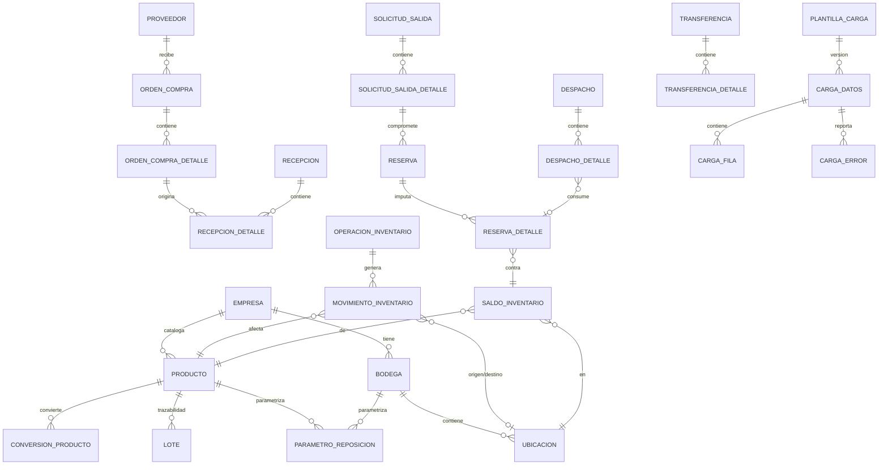

# Modelo de datos

Fuente única de verdad: [`backend/prisma/schema.prisma`](../backend/prisma/schema.prisma)
(más de 50 entidades). Las migraciones ejecutables están en
`backend/prisma/migrations/`. Este documento resume el modelo conceptual/lógico y
explica las reglas de integridad que no se ven a simple vista en el esquema.

## 1. Modelo conceptual (núcleo operativo)



> El diagrama omite, por espacio, entidades secundarias (auditoría, aprobaciones,
> capas de costo, conteos/ajustes, devoluciones, alertas). Todas están en el schema
> Prisma con sus relaciones y claves foráneas completas.

## 2. Diccionario de datos — entidades núcleo

### `productos`
| Campo | Tipo | Obligatorio | Regla |
|---|---|---|---|
| `codigo` | text | Sí | Único **dentro de la empresa** (`@@unique([empresaId, codigo])`), no globalmente |
| `unidad_base_id` | FK unidades_medida | Sí | Toda cantidad de inventario se almacena en unidad base |
| `control_lote` / `control_serie` / `control_vencimiento` | boolean | No (default false) | Si `control_lote=true`, la recepción exige `loteCodigo` (validado en `recepcion.service.ts`) |
| `metodo_valorizacion` | enum `PROMEDIO_PONDERADO`\|`FIFO` | Sí (default PROMEDIO_PONDERADO) | Ver `docs/arquitectura.md` §valorización; cambiarlo con inventario existente requiere migración manual (no implementado como flujo guiado — pendiente) |

### `saldos_inventario`
Clave de negocio real: `(producto_id, ubicacion_id, lote_id, serie_id, estado_inventario)`.
Postgres trata cada `NULL` como distinto en un `UNIQUE` normal, así que la restricción
`@@unique` de Prisma **no** basta cuando lote/serie son `NULL` (el caso más común).
La migración `20260907124727_saldo_business_key` agrega un índice único funcional:

```sql
CREATE UNIQUE INDEX saldos_inventario_clave_negocio
ON saldos_inventario (
  producto_id, ubicacion_id,
  COALESCE(lote_id, '00000000-0000-0000-0000-000000000000'),
  COALESCE(serie_id, '00000000-0000-0000-0000-000000000000'),
  estado_inventario
);
```

El servicio de inventario usa el mismo centinela al leer/escribir, garantizando que
nunca existan dos filas de saldo para la misma combinación real.

**Nunca se escribe directamente.** Solo `registrarMovimiento()` la modifica, siempre
junto con la fila de `movimientos_inventario` que la explica, dentro de la misma
transacción de base de datos.

### `movimientos_inventario`
Tabla de solo inserción (INSERT-only). Nunca se actualiza ni se borra. Cada fila referencia
la `operacion_id` (documento/proceso que la originó), y opcionalmente `ubicacion_origen_id`
y/o `ubicacion_destino_id`:

- Solo destino → entrada (recepción, ajuste positivo, apertura inicial).
- Solo origen → salida (despacho, ajuste negativo, baja).
- Origen **y** destino → traslado/reclasificación en un mismo movimiento (transferencia
  origen→tránsito, tránsito→destino).

`cantidad` es siempre una magnitud positiva; el signo lo determina cuál de los dos
campos de ubicación viene informado (documentado en el código, `inventario.service.ts`).

### `reservas` / `reservas_detalle`
Una reserva es un **compromiso**, no una salida. `reservas_detalle.cantidad` es lo
reservado contra un `saldo_id` específico; `cantidad_consumida` avanza a medida que se
despacha. `stock_libre = stock_utilizable − (cantidad − cantidad_consumida)` sumado por
todas las reservas activas sobre ese saldo.

### `operaciones_inventario`
Encabezado común a toda operación que puede tocar inventario. Lleva `empresa_id`,
`bodega_id`, `fecha_efectiva` (fecha de negocio) separada de `fecha_registro`
(momento real de sistema, `default(now())`), `usuario_id`, `autorizado_por_id`, y
`operacion_origen_id` para encadenar una operación compensatoria con la que corrige,
sin reescribir historial.

### `cargas_datos` / `cargas_filas` / `cargas_errores`
Ver `docs/centro-de-cargas.md` para el flujo completo. La idempotencia se calcula como
`sha256(empresa_id | entidad | modo | contenido_del_archivo | contexto)` — **no** por
nombre de archivo — y se persiste en `cargas_datos.clave_idempotencia` (`UNIQUE`).
Repetir la misma carga retorna el registro existente en vez de duplicar filas.
`cargas_datos.contexto` (JSON, opcional) guarda parámetros propios de ciertas entidades
que no vienen en el archivo (p. ej. `bodegaDestinoId` para `LLEGADA_PRODUCTOS`).

### `llegadas_producto` / `precios_venta`
Soportan la entidad de carga `LLEGADA_PRODUCTOS` y el mantenedor de precios de venta
(ver `docs/modulos.md` y `docs/plan-implementacion.md` fase 6 para las decisiones de
diseño). `llegadas_producto` es un registro histórico por fila importada (nunca se
actualiza una fila existente con una llegada nueva: cada llegada es un evento propio),
con `movimiento_id` (único, opcional) apuntando al movimiento de inventario real que
generó si `cantidad_enviada > 0`. `precios_venta` tiene una fila **por producto**
(`@@unique([productoId])`): `precio_venta_calculado` (siempre el precio **neto**, sin
impuestos) se recalcula y persiste cada vez que cambia el modo, el margen/precio fijo,
o llega un nuevo `valor_referencia_clp` desde una llegada — nunca se computa "al vuelo"
en el momento de leer. `afecto_iva` (booleano, por defecto `true`) indica si el producto
lleva IVA (19%, tasa fija del sistema); `precio_venta_con_iva` se recalcula y persiste
junto al neto en ese mismo momento, aplicando la tasa solo si `afecto_iva` es `true`.

`Producto` ganó tres columnas opcionales para esta fase: `codigo_mercado_libre`
(indexado, **no** único — una misma publicación de Mercado Libre agrupa varias
unidades físicas distintas, confirmado con datos reales), `codigo_original_proveedor`
y `grupo`. El código interno real del producto (`Producto.codigo`, único por empresa)
que arma el manejador `LLEGADA_PRODUCTOS` es la combinación `codigo` + `codigo_ml` del
Excel (`"<codigo>::<codigo_ml>"`), no `codigo` solo — ver `docs/centro-de-cargas.md`.

## 3. Reglas de integridad transversales

- **Aislamiento multiempresa**: toda tabla operativa lleva `empresa_id` (directa o vía
  `bodega_id`/`producto_id`). Las relaciones Prisma con `@relation` generan claves
  foráneas reales en PostgreSQL; las consultas de la API siempre agregan el filtro de
  empresa del usuario autenticado.
- **Tipos numéricos**: cantidades, costos y factores de conversión usan
  `Decimal(18,6)` (o `Decimal(14,4)` para parámetros de stock) — nunca `float`, para
  evitar errores de redondeo acumulados.
- **Enumeraciones nativas de PostgreSQL** para estados (`EstadoOperacion`,
  `EstadoInventario`, `EstadoCarga`, etc.), evitando strings libres para datos de control.
- **Fecha efectiva vs. fecha de registro**: separadas en toda tabla operativa relevante
  (`operaciones_inventario`, `movimientos_inventario`). El manejo de períodos cerrados
  (bloquear `fecha_efectiva` en un rango cerrado) está **documentado como pendiente**
  (no implementado) — ver `plan-implementacion.md`.
- **Conversión de unidades versionada**: `conversiones_producto` tiene `vigenteDesde` /
  `vigenteHasta`; un cambio de factor no reescribe conversiones pasadas ni los
  movimientos ya registrados (que ya guardan la cantidad en unidad base).

## 4. Migraciones

| Migración | Contenido |
|---|---|
| `20260907124654_init` | Esquema completo inicial (todas las entidades) |
| `20260907124727_saldo_business_key` | Índice único funcional de saldos (ver §2) |
| `20260907125843_relaciones_bodega` | Relaciones FK explícitas bodega↔recepción/despacho/solicitud_salida/conteo/ajuste/transferencia, para integridad referencial real y filtrado por empresa |
| `20260907130500_folios_por_bodega` | Folios de transferencias/conteos/ajustes/devoluciones/preparaciones dejan de ser únicos globalmente y pasan a ser únicos por bodega (evita colisiones entre empresas/bodegas distintas) |
| `20260907140000_devoluciones_flujo` | Campos de resolución en `devoluciones`/`devoluciones_detalle` (motivo, evidencia, responsable, operación de resolución) |
| `20260907180000_demanda_unica_por_dia` | Índice único `(producto_id, bodega_id, fecha)` en `demanda_registrada`, para poder acumular la demanda del día con `upsert` sin duplicar filas |
| `20260907190000_movimiento_estado_origen` | Agrega `estado_inventario_origen` a `movimientos_inventario` (ver §5) |
| `20260908143228_llegadas_producto_y_precios` | Nuevas tablas `llegadas_producto` y `precios_venta`; nuevas columnas en `productos` (`codigo_mercado_libre`, `codigo_original_proveedor`, `grupo`); `cargas_datos.contexto` (JSON) |
| `20260908160111_codigo_ml_no_unico` | Corrige `productos.codigo_mercado_libre`: de `UNIQUE` a índice simple (no es único, ver §2) |

Ejecutar `npm run prisma:migrate` (desarrollo) o `npm run prisma:deploy` (aplicar en un
entorno existente sin generar nuevas migraciones) desde `backend/`.

## 5. Reconstrucción y conciliación de saldos

Como el saldo es una proyección derivada, siempre puede reconstruirse sumando
`movimientos_inventario` agrupado por `(producto_id, ubicacion_destino_id, lote_id,
serie_id, estado_inventario)` menos lo agrupado por `(ubicacion_origen_id, ...,
estado_inventario_origen)` en el mismo grano.

Un movimiento con origen y destino en la **misma** bodega pero con estados de
inventario distintos (por ejemplo, una transferencia: origen `DISPONIBLE`, destino
`TRANSITO`; o la resolución de una devolución: origen `CUARENTENA`, destino
`DISPONIBLE`) no puede representarse con una sola columna de estado — por eso
`movimientos_inventario` guarda `estado_inventario` (el del lado destino, o el único
estado si no hay destino) y `estado_inventario_origen` (el del lado origen, cuando
corresponde) por separado. Sin esta distinción, una reconciliación que sumara ambos
lados a la misma "cuenta" de estado arrastraría un error sistemático en cualquier
operación que cruce estados.

**Implementado**: `modules/inventario/reconciliacion.service.ts` reconstruye cada saldo
con esta lógica (vía una consulta SQL con `FULL OUTER JOIN` entre lo calculado desde
movimientos y lo registrado en `saldos_inventario`) y reporta cualquier diferencia,
tanto "saldo con menos existencia de la que deberían mostrar los movimientos" como el
caso inverso. Se expone como `GET /api/indicadores/reconciliacion` y como script de
línea de comandos (`npm run reconciliar -- <rut-o-id-de-empresa>` desde `backend/`, con
código de salida distinto de cero si encuentra diferencias, apto para un chequeo
automatizado). Probado explícitamente forzando una alteración manual de
`saldos_inventario` fuera del motor de movimientos y verificando que se detecta
(`tests/reconciliacion.test.ts`).

## 6. Períodos cerrados

No se agregó una tabla dedicada: la fecha de cierre vive en `parametros`
(`clave = "fecha_cierre_periodo"`, `valor` = fecha ISO), un parámetro más por empresa,
consistente con cómo ya se modelan otros ajustes configurables. `crearOperacion` — el
único punto de entrada para registrar cualquier operación de inventario — consulta este
parámetro y rechaza una `fechaEfectiva` igual o anterior al cierre, salvo que el
llamador pase explícitamente `permitirPeriodoCerrado: true` (algo que ningún flujo hace
en este entregable). `definirFechaCierre` no permite retroceder un cierre ya
establecido. Ver `modules/inventario/periodos.service.ts`.

## 7. Multimoneda

`CapaCosto` ya modelaba `moneda` y `tipoCambio` desde el diseño inicial; lo que faltaba
era poblarlos. La regla implementada: **todo costo se convierte a la moneda de la
empresa en el momento del ingreso** (recepción), nunca en el momento de reportar. Una
línea de recepción puede venir facturada en una moneda distinta, con su tipo de cambio;
`recepcion.service.ts` calcula `costoUnitarioBase = costoUnitarioFacturado × tipoCambio`
y usa ese valor base para el movimiento de inventario y la capa de costo (que además
guarda `moneda` y `tipoCambio` originales para trazabilidad), mientras que
`recepcion_detalle.costoUnitario` conserva el valor tal como fue facturado, sin
convertir — es el documento fuente, debe reflejar lo que llegó, no lo que se calculó.
Si la moneda de la línea difiere de la de la empresa y no se informa un tipo de cambio,
la recepción se rechaza: nunca se asume una tasa de 1:1 silenciosamente. Como
consecuencia de convertir en el ingreso, los indicadores y tableros nunca mezclan
monedas — todos ya están en la moneda base —, aunque no exista (todavía) una vista que
muestre valores en una moneda de reporte distinta a la base de la empresa.
