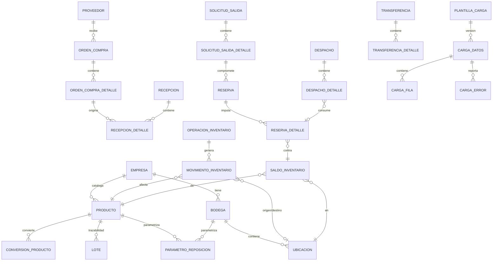

# Modelo de datos

Fuente única de verdad: [`backend/prisma/schema.prisma`](../backend/prisma/schema.prisma)
(más de 50 entidades). Las migraciones ejecutables están en
`backend/prisma/migrations/`. Este documento resume el modelo conceptual/lógico y
explica las reglas de integridad que no se ven a simple vista en el esquema.

## 1. Modelo conceptual (núcleo operativo)



> El diagrama omite, por espacio, entidades secundarias (auditoría, aprobaciones,
> capas de costo, conteos/ajustes, devoluciones, alertas). Todas están en el schema
> Prisma con sus relaciones y claves foráneas completas.

## 2. Diccionario de datos — entidades núcleo

### `productos`
| Campo | Tipo | Obligatorio | Regla |
|---|---|---|---|
| `codigo` | text | Sí | Único **dentro de la empresa** (`@@unique([empresaId, codigo])`), no globalmente |
| `unidad_base_id` | FK unidades_medida | Sí | Toda cantidad de inventario se almacena en unidad base |
| `control_lote` / `control_serie` / `control_vencimiento` | boolean | No (default false) | Si `control_lote=true`, la recepción exige `loteCodigo` (validado en `recepcion.service.ts`) |
| `metodo_valorizacion` | enum `PROMEDIO_PONDERADO`\|`FIFO` | Sí (default PROMEDIO_PONDERADO) | Ver `docs/arquitectura.md` §valorización; cambiarlo con inventario existente requiere migración manual (no implementado como flujo guiado — pendiente) |

### `saldos_inventario`
Clave de negocio real: `(producto_id, ubicacion_id, lote_id, serie_id, estado_inventario)`.
Postgres trata cada `NULL` como distinto en un `UNIQUE` normal, así que la restricción
`@@unique` de Prisma **no** basta cuando lote/serie son `NULL` (el caso más común).
La migración `20260907124727_saldo_business_key` agrega un índice único funcional:

```sql
CREATE UNIQUE INDEX saldos_inventario_clave_negocio
ON saldos_inventario (
  producto_id, ubicacion_id,
  COALESCE(lote_id, '00000000-0000-0000-0000-000000000000'),
  COALESCE(serie_id, '00000000-0000-0000-0000-000000000000'),
  estado_inventario
);
```

El servicio de inventario usa el mismo centinela al leer/escribir, garantizando que
nunca existan dos filas de saldo para la misma combinación real.

**Nunca se escribe directamente.** Solo `registrarMovimiento()` la modifica, siempre
junto con la fila de `movimientos_inventario` que la explica, dentro de la misma
transacción de base de datos.

### `movimientos_inventario`
Tabla de solo inserción (INSERT-only). Nunca se actualiza ni se borra. Cada fila referencia
la `operacion_id` (documento/proceso que la originó), y opcionalmente `ubicacion_origen_id`
y/o `ubicacion_destino_id`:

- Solo destino → entrada (recepción, ajuste positivo, apertura inicial).
- Solo origen → salida (despacho, ajuste negativo, baja).
- Origen **y** destino → traslado/reclasificación en un mismo movimiento (transferencia
  origen→tránsito, tránsito→destino).

`cantidad` es siempre una magnitud positiva; el signo lo determina cuál de los dos
campos de ubicación viene informado (documentado en el código, `inventario.service.ts`).

### `reservas` / `reservas_detalle`
Una reserva es un **compromiso**, no una salida. `reservas_detalle.cantidad` es lo
reservado contra un `saldo_id` específico; `cantidad_consumida` avanza a medida que se
despacha. `stock_libre = stock_utilizable − (cantidad − cantidad_consumida)` sumado por
todas las reservas activas sobre ese saldo.

### `operaciones_inventario`
Encabezado común a toda operación que puede tocar inventario. Lleva `empresa_id`,
`bodega_id`, `fecha_efectiva` (fecha de negocio) separada de `fecha_registro`
(momento real de sistema, `default(now())`), `usuario_id`, `autorizado_por_id`, y
`operacion_origen_id` para encadenar una operación compensatoria con la que corrige,
sin reescribir historial.

### `cargas_datos` / `cargas_filas` / `cargas_errores`
Ver `docs/centro-de-cargas.md` para el flujo completo. La idempotencia se calcula como
`sha256(empresa_id | entidad | modo | contenido_del_archivo)` — **no** por nombre de
archivo — y se persiste en `cargas_datos.clave_idempotencia` (`UNIQUE`). Repetir la misma
carga retorna el registro existente en vez de duplicar filas.

## 3. Reglas de integridad transversales

- **Aislamiento multiempresa**: toda tabla operativa lleva `empresa_id` (directa o vía
  `bodega_id`/`producto_id`). Las relaciones Prisma con `@relation` generan claves
  foráneas reales en PostgreSQL; las consultas de la API siempre agregan el filtro de
  empresa del usuario autenticado.
- **Tipos numéricos**: cantidades, costos y factores de conversión usan
  `Decimal(18,6)` (o `Decimal(14,4)` para parámetros de stock) — nunca `float`, para
  evitar errores de redondeo acumulados.
- **Enumeraciones nativas de PostgreSQL** para estados (`EstadoOperacion`,
  `EstadoInventario`, `EstadoCarga`, etc.), evitando strings libres para datos de control.
- **Fecha efectiva vs. fecha de registro**: separadas en toda tabla operativa relevante
  (`operaciones_inventario`, `movimientos_inventario`). El manejo de períodos cerrados
  (bloquear `fecha_efectiva` en un rango cerrado) está **documentado como pendiente**
  (no implementado) — ver `plan-implementacion.md`.
- **Conversión de unidades versionada**: `conversiones_producto` tiene `vigenteDesde` /
  `vigenteHasta`; un cambio de factor no reescribe conversiones pasadas ni los
  movimientos ya registrados (que ya guardan la cantidad en unidad base).

## 4. Migraciones

| Migración | Contenido |
|---|---|
| `20260907124654_init` | Esquema completo inicial (todas las entidades) |
| `20260907124727_saldo_business_key` | Índice único funcional de saldos (ver §2) |
| `20260907125843_relaciones_bodega` | Relaciones FK explícitas bodega↔recepción/despacho/solicitud_salida/conteo/ajuste/transferencia, para integridad referencial real y filtrado por empresa |

Ejecutar `npm run prisma:migrate` (desarrollo) o `npm run prisma:deploy` (aplicar en un
entorno existente sin generar nuevas migraciones) desde `backend/`.

## 5. Reconstrucción y conciliación de saldos

Como el saldo es una proyección derivada, siempre puede reconstruirse sumando
`movimientos_inventario` agrupado por `(producto_id, ubicacion_destino_id, lote_id,
serie_id, estado_inventario)` menos lo agrupado por `ubicacion_origen_id` en el mismo
grano. Un script de conciliación que compare esa suma contra `saldos_inventario` y
reporte diferencias **no está implementado en este entregable** — se deja como tarea
explícita de la fase de endurecimiento operativo (`plan-implementacion.md`, fase 4).
